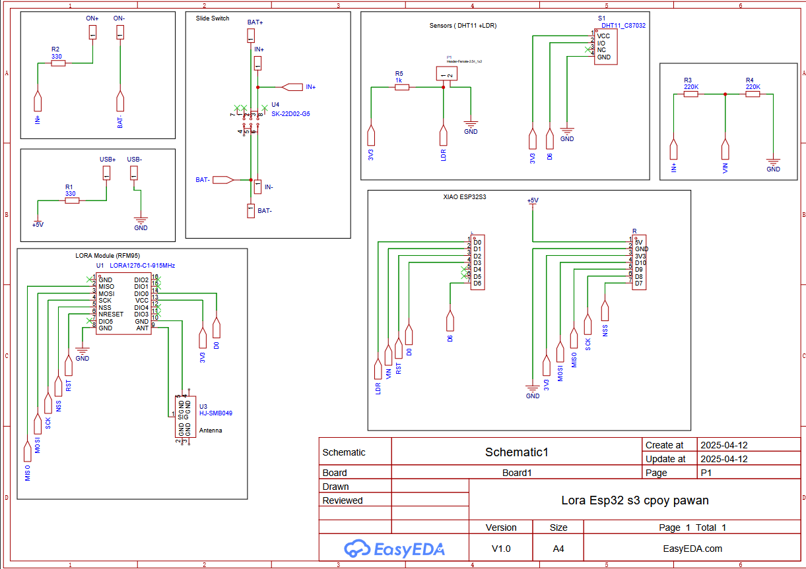
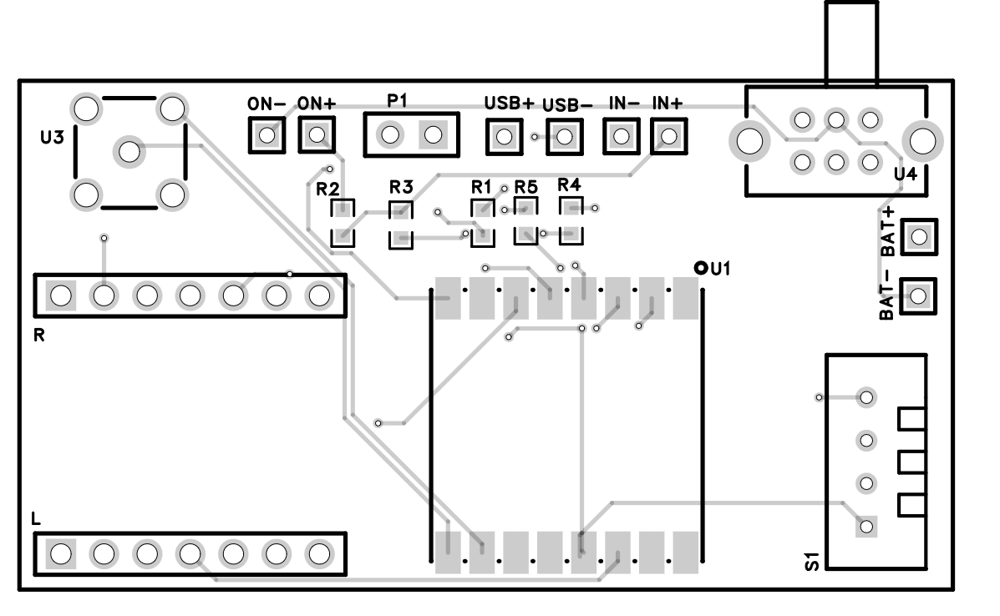
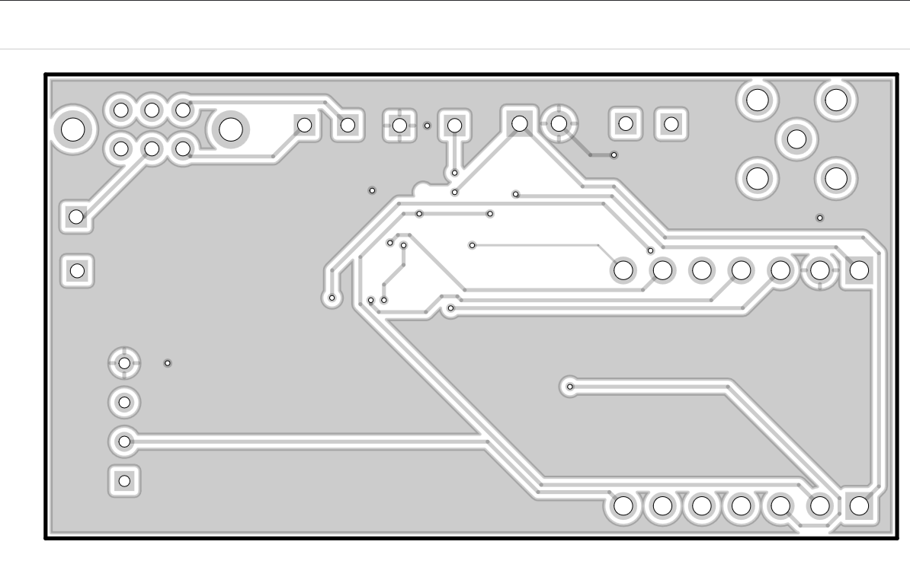
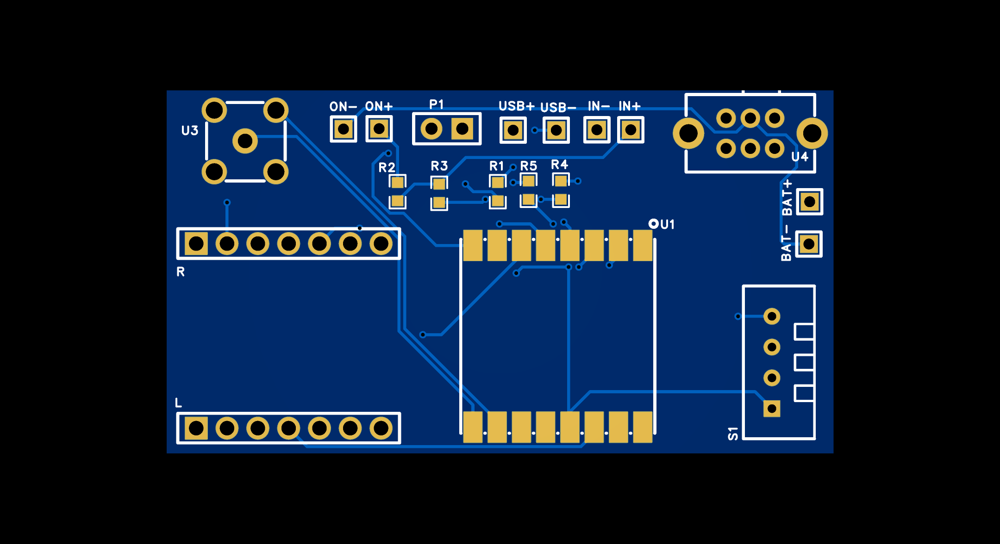
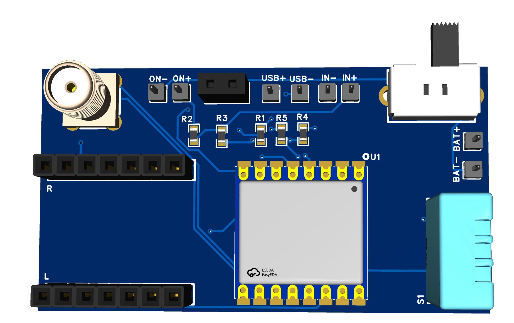

# 📡 Wireless Environmental Monitoring Circuit Using LoRa and XIAO ESP32 S3

This project involves the design and implementation of a wireless environmental monitoring system. The system is built using EasyEDA and utilizes a custom-designed **2-layer PCB** to measure **temperature**, **humidity**, and **light intensity**. These values are transmitted wirelessly over **LoRa** to a remote receiver, enabling real-time environmental tracking even in remote or off-grid areas.

---

## 📦 Components Used

- **LoRa Module** – Enables wireless long-range communication with low power consumption.
- **XIAO ESP32 S3** – Ultra-compact microcontroller with built-in Wi-Fi/BLE, perfect for space-limited PCBs.
- **DHT11 Sensor** – Provides temperature and humidity data.
- **LDR (Light Dependent Resistor)** – Measures ambient light levels.
- **1kΩ Resistor** – Used with the LDR in a voltage divider configuration.
- **Slider Switch (SK-22D02-G5)** – Used to control power to the circuit.
- **Headers and Resistors** – For modular interfacing and signal conditioning.

---

## 🧠 Project Functionality

The XIAO ESP32 S3 reads data from the DHT11 and LDR sensors and processes the input. The LDR is connected in a **voltage divider** with a **1kΩ resistor**, allowing the ESP32 to sense light intensity as a voltage level. 

The **SK-22D02-G5 slider switch** is used to **toggle the power** supply to the board, providing a reliable and compact method of turning the system on or off.

The processed sensor data is transmitted via LoRa to a compatible receiver, enabling wireless monitoring of:

- 🌡️ **Temperature**  
- 💧 **Humidity**  
- 💡 **Ambient Light Intensity**

---

## 🧩 PCB Design Details

The custom PCB was designed in **EasyEDA** with a compact **2-layer layout**:

- 🟦 **Top Layer**: Contains all primary components including the microcontroller, sensors, LoRa module, and slider switch (SK-22D02-G5).
- 🟥 **Bottom Layer**: Dedicated **copper ground plane** to:
  - Reduce electrical noise
  - Improve power distribution
  - Ensure stable sensor readings
  - Provide thermal dissipation

The PCB layout was optimized for **space efficiency**, **minimal interference**, and ease of assembly, meeting the design constraints of **30x55 mm** and maintaining a **15.24 mm spacing between ESP32 headers**.

---

## 📸 Screenshots of the Design

### 🔌 Circuit Diagram

### 🔷 PCB Layout - Front View

### 🔶 PCB Layout - Back View

### 🔭 2D View

### ⚙️ 3D View 

---

## 🚀 Applications

- 🌾 **Smart Agriculture** – Monitor field conditions (light, humidity, temperature) remotely
- 🌧️ **Weather Stations** – Track environmental parameters in isolated areas
- 🏕️ **Remote Data Logging** – Ideal for forest or mountain sensor nodes
- 🏠 **Home Automation** – Can be integrated into indoor IoT setups
- 📡 **LoRa IoT Networks** – Acts as a reliable node in low-power wide-area networks

---

## 🌱 Possible Future Improvements

- Add **solar charging** and **battery management** circuit for autonomous deployment
- Upgrade to **DHT22** for improved sensor accuracy
- Add **real-time clock (RTC)** for time-stamped data
- Include an **OLED display** for real-time local monitoring
- Add a **motion sensor** for extended monitoring capabilities
- Develop a **LoRa receiver dashboard** using Python or Node-RED to visualize incoming data

---

## ✅ Conclusion

This PCB design effectively integrates environmental sensors with LoRa and a compact microcontroller to form a functional, efficient, and scalable **IoT solution**. The use of the **SK-22D02-G5 slider switch** enhances usability, while the copper ground plane ensures stability and performance. It’s ready for real-world deployment in a wide range of wireless sensing applications.

---

> 🛠️ Designed and documented by **[Pawan Gupta]**  
> 📅 Date: 12 April 2025  
> 🖥️ Tool Used: EasyEDA
